# Remote Telemetry System (RTS)

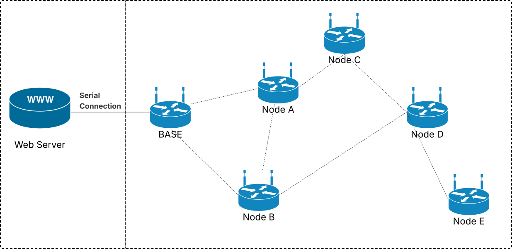

Remote Telemetry System, or RTS, is a long-range, infrastructure-less telemetry system utilizing LoRa radio. The goal is to enable long-range radio communications, deployable at scale, where traditional LoRaWAN is impractical, expensive, or even impossible.

Numerous telemetry systems depend on pre-existing infrastructure. Often requiring gateways, internet access, and costly installation. In a remote or constrained environment, this becomes quite difficult to accomplish.

RTS aims to provide a modular foundation for reliable long-range communication without needing pre-existing infrastructure, while remaining compliant with regional radio regulations.

> **Prototype status:** this repository contains the radio component of RTS. The current prototype showcases the core foundation of the RTS network: packet structure, network join, duty-cycle aware transmission, control/data separation, NACK-based recovery, ETX/RSSI benchmarking, and base station routing table computation and distribution. RTS is still an active prototype and is expected to continue beyond this version. Full webserver integration, dynamic ETX-based routing updates, persistence, and larger scale field testing remain future work.

---

## Contents

- [Project Overview](#project-overview)
- [Main Features](#main-features)
- [System Architecture](#system-architecture)
- [Hardware and Runtime Environment](#hardware-and-runtime-environment)
- [Protocol Design](#protocol-design)
- [Duty-Cycle Compliance and Band Scheduling](#duty-cycle-compliance-and-band-scheduling)
- [Network Join and Startup](#network-join-and-startup)
- [Peer Tracking and Sequence Handling](#peer-tracking-and-sequence-handling)
- [NACK Recovery](#nack-recovery)
- [ETX and RSSI Link Benchmarking](#etx-and-rssi-link-benchmarking)
- [Routing and Path Planning](#routing-and-path-planning)
- [Maintainability and Refactoring](#maintainability-and-refactoring)
- [Testing and Evaluation](#testing-and-evaluation)
- [Current Limitations](#current-limitations)
- [Future Work](#future-work)
- [References](#references)

---

## Project Overview

The Remote Telemetry System is a custom long-range radio communication protocol. It is designed to enable telemetry data collection in remote or infrastructure-less environments.

The system is based on a network of radio nodes which collect telemetry data and forward it towards a predefined sink node, called the Base Station. The Base Station is responsible for bridging the webserver and the radio network, enabling network status information to be accessed from the website.

This repository is focused on designing and prototyping the radio communication of RTS. The implemented prototype includes:

- Custom packet structure and parameters format
- Peer discovery through a network joining process
- Duty-cycle aware band scheduling and transmission
- Control and data traffic separation
- Frequency switching
- Message sequence tracking
- NACK-based recovery mode
- ETX and RSSI link benchmarking
- Base station routing table computation and distribution

The webserver component is part of the wider system architecture, meant to provide persistent storage, trend analysis, PDF report generation, network monitoring, and niche node configuration control.

---

## Main Features

### Implemented in the current prototype

- Nodes can send and receive radio packets.
- Nodes have two separate control and data traffic planes.
- Nodes can attempt to join a network.
- Nodes can acknowledge valid control messages.
- Nodes can track neighbouring peers.
- Nodes can recover missed packets via NACK.
- Nodes can send specialized control and routing packets.
- Nodes can track band airtime usage.
- Nodes can benchmark links with ETX.
- Base station logic supports route planning and distribution.

### Non-functional priorities

- Must respect EU863-870 regulations.
- Must run on constrained CircuitPython hardware.
- Must be efficient with packet transmission.
- Must have modular and maintainable architecture.
- Must tolerate unreliable radio communication.
- Must be extensible for future low and high-level features.

---

## System Architecture

An RTS network requires three distinct components: Base Station, Radio Nodes, and Web Server.

### Base Station

The Base Station acts as a sink node, where all telemetry data collected by radio nodes are forwarded to it. Additionally, it is responsible for routing decisions and forwarding commands issued by the webserver.

The Base Station is expected to be connected to the webserver via serial connection. Expansion of its functionality to collect local telemetry data is possible, however, limited number of applications are likely to benefit from this, thus it has not been implemented.

### Radio Node

A radio node includes the sensors required to collect telemetry data from its deployed environment. There are no strict limitations as to what these sensors could be. RTS provides the foundation for communication and does not limit the type of data which could be transmitted.

The Base Station and radio nodes are typically identical in terms of hardware but not strictly required. As long as all nodes and the Base Station support RTS, they could run on various hardware.

### Web Server

The webserver is responsible for persistent storage of telemetry data, analysis of trends, and generation of heatmaps, graphs, anomaly reports, and other diagrams depending on the application.

It is also expected to monitor radio node status, such as link quality, battery voltage, last transmission, band duty-cycle usage, and any further application-specific details.

The webserver should also be able to override network configurations, such as routing decisions performed by the Base Station, or modify radio features such as spreading factor, bandwidth, transmission power, and more depending on the capabilities of the hardware utilized.

---

## Hardware and Runtime Environment

The selected hardware had to be affordable, widely supported, and able to run a version of Python. It also had to include a radio chip capable of transmitting LoRa radio waves, while providing a library that handles lower-level radio operations.

When developing software for a device which requires close access to hardware, C/C++ is often chosen due to higher efficiency, performance, explicit control over memory, and robustness. However, choosing such hardware would require dealing with lower-level programming and shift the project towards electrical and electronics engineering, which goes beyond the scope and primary goal of the project.

### Challenger RP2040 LoRa board

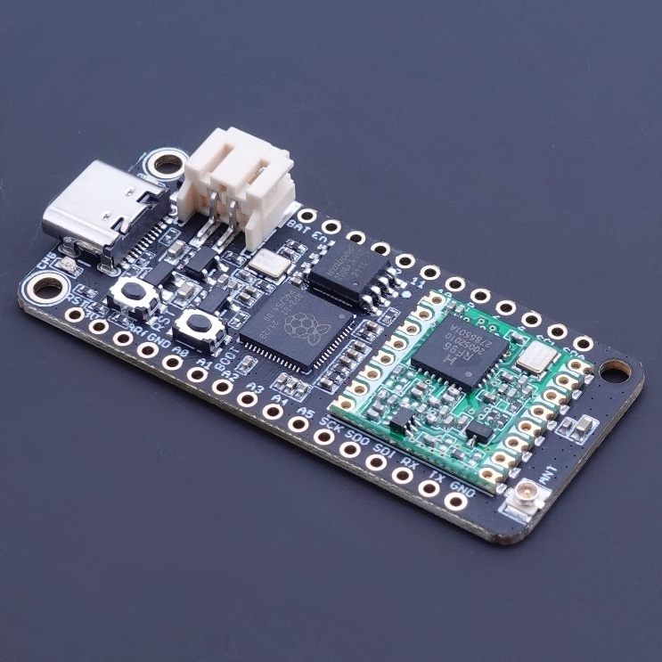

A compromise was made when it came to prototype hardware, balancing affordability and software support.

The Challenger RP2040 LoRa is compatible with CircuitPython and is provided with the Adafruit RFM9x library, which originally only had basic send and receive behaviour.

### RFM95 Radio Chip

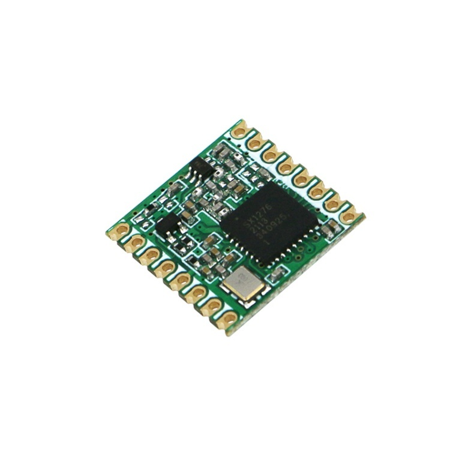

The Challenger board is equipped with the RFM95 radio chip, which is capable of transmitting LoRa radio waves and is targeted towards commercial use, hence its affordability.

During hardware testing, it was discovered that the chip is only capable of listening to roughly 1 MHz of bandwidth, around 500 kHz in both directions from the central frequency. Focusing on 865.0 MHz would roughly equate to being able to detect messages from 864.5 MHz to 865.5 MHz.

More capable radio chips are able to listen to a larger bandwidth. This prompted the design of the `FREQUENCY_SWITCH` command, used to coordinate the usage of all available bands.

### Patching the RFM9x Library

The RFM9x library had to be modified to remain compliant with the law and adhere to the protocol being developed.

More importantly, the library provided a send method with an optional ACK flag. When the receiving function encountered this flag, it would reply back without performing the processes required by the protocol, which are needed to remain compliant with radio regulations.

This behaviour has been removed from the library. The patched library now strictly sends or receives when invoked.

CircuitPython on the Challenger board also lacked support for some standard Python features, such as enums, dataclasses, and the standard Python typing library. This forced a redesign of certain parts of the protocol and architecture to remain compatible with the board while staying modular.

---

## Protocol Design

### Packet types

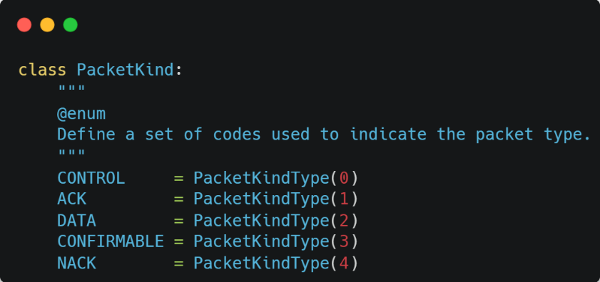

The protocol defines five packet types:

| Packet Type | Purpose |
|---|---|
| `CONTROL` | Carries peer-to-peer control parameters. |
| `ACK` | Acknowledges a valid control message or specific control flow. |
| `DATA` | Carries sensor data. |
| `CONFIRMABLE` | Reserved for future use cases where an ACK is explicitly required before continuing. |
| `NACK` | Requests missed data packets only. |

### Packet headers

The total header size is 4 bytes, with 4 header fields, each a single byte, or 8-bit unsigned integer. Thus, the valid values are 0 to 255.

The fields are:

1. Destination
2. Source
3. Identifier
4. Packet type

The destination and source indicate the targeted node ID and transmitter node ID. The identifier is used for sequencing. Packet type indicates which packet type is being transmitted.

### Message format and parameters

Packets of control and data type follow a specific format. Messages include fields where a single parameter, or keyword, has a single or multiple values. The parameters are predefined and have built-in validation functions.

<table>
<tr>
<td>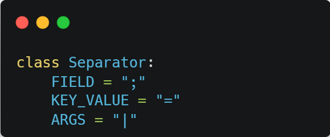</td>
<td>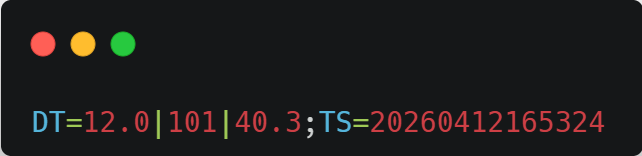</td>
</tr>
</table>

The separator class defines the characters used to isolate different fields, separate keyword from value, and separate multiple arguments within a value.

### Parameters

<table>
<tr>
<td>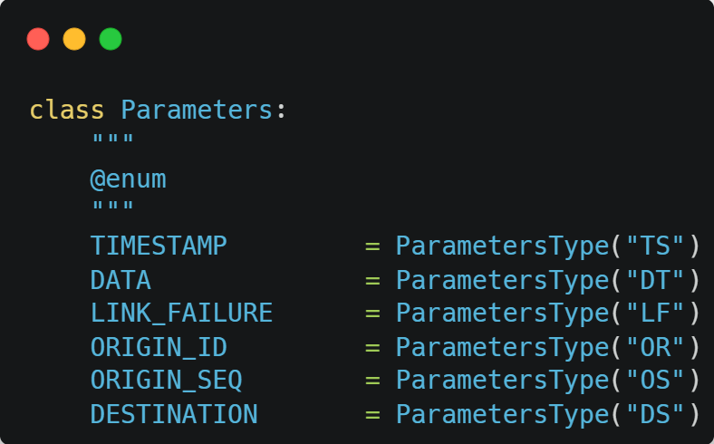</td>
<td>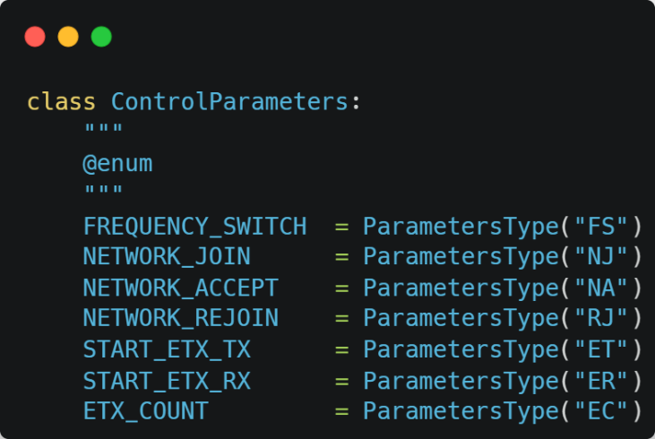</td>
<td>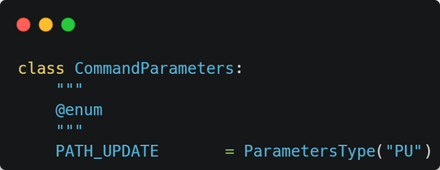</td>
</tr>
</table>

Common parameters include:

- `TIMESTAMP`: contains 14 digits following year, month, day, hour, minute, second.
- `DATA`: used to include sensor data.
- `LINK_FAILURE`: used when forwarding through a parent fails.
- `ORIGIN_ID`: indicates the original source ID of the packet.
- `ORIGIN_SEQ`: original sequence number from the original source to its parent.
- `DESTINATION`: indicates the final destination node ID.

Control parameters are exclusively used for peer-to-peer communication and are not forwardable. These include `FREQUENCY_SWITCH`, `NETWORK_JOIN`, `NETWORK_ACCEPT`, `NETWORK_REJOIN`, `START_ETX_TX`, `START_ETX_RX`, and `ETX_COUNT`.

Routing parameters are forwardable across the network. The current forwardable routing parameter is `PATH_UPDATE`, which holds serialized routing table data.

---

## Duty-Cycle Compliance and Band Scheduling

Plenty of hobbyist LoRa projects available online do not fully consider EU863-870 or EU433 regulations. Typically, such projects are limited in functionality, with predefined radio configurations, packet sizes, and a small network size.

RTS targets multiple applications, including industrial, agricultural, commercial, and other deployments. While also competing with LoRaWAN, compliance with local regulations becomes a must.

### Airtime calculations

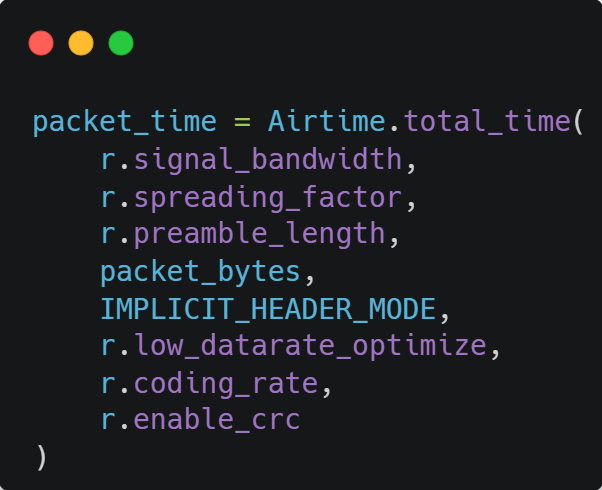

Before any transmission, the `Airtime` module is called, providing all related arguments to calculate packet airtime. RTS uses:

- Bandwidth: 125 kHz
- Spreading factor: 7
- Preamble length: 8
- Coding rate: 4/5
- Explicit header mode
- CRC enabled
- Low data rate optimization disabled by default

The formulae were taken from the Semtech SX1276/77/78/79 datasheet. The full set of methods implementing the rest of the formulae are available in `node/mac/airtime.py`.

### Rolling hourly duty-cycle tracking

A dedicated `BandAirtime` class is responsible for tracking cumulative airtime usage through a rolling hourly window for a single band. Each band has its own `BandAirtime` instance, and `DutyCycleTracker` manages those instances.

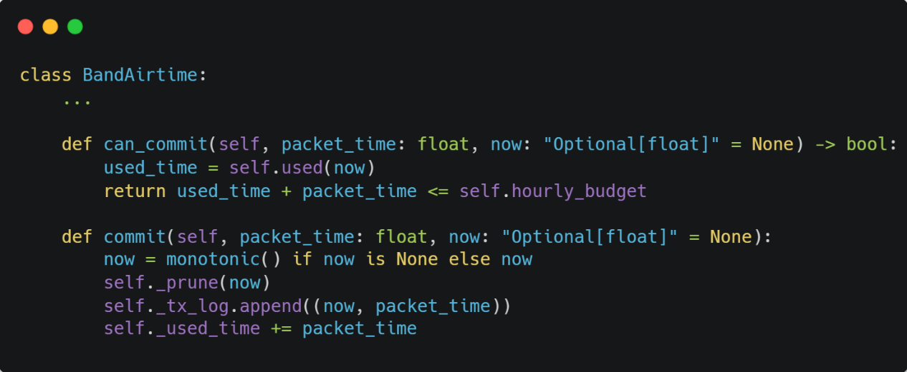

The design choice to use a rolling hourly window instead of a fixed window removes the dependency on synchronized clocks. It also prevents burst behaviour at the boundary between two fixed windows.

For example, with a fixed window, a node could transmit for 30 seconds at 19:59:30 and then transmit another 30 seconds at 20:00:00. A rolling hourly window prevents this by ensuring that, at all times, the duty-cycle limit is met.

### Band selection

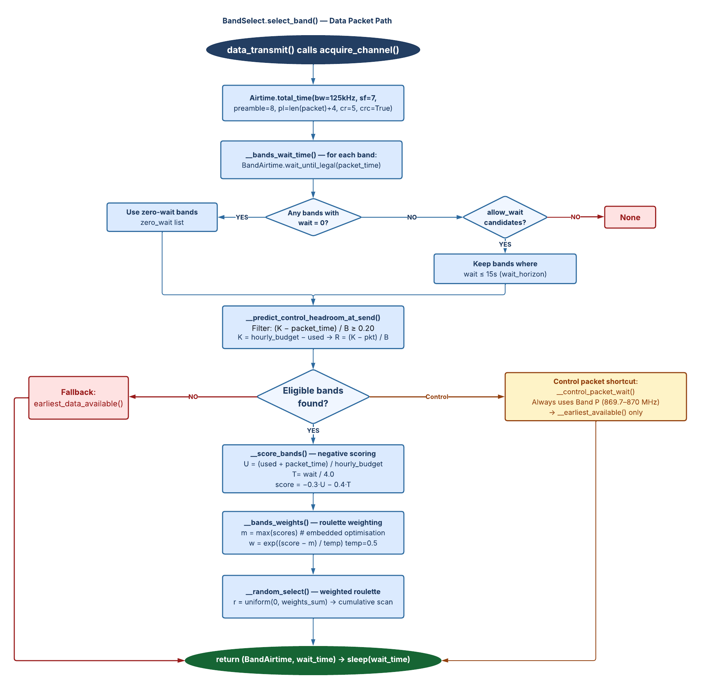

Band selection is an essential part of RTS. It is necessary to effectively utilize available airtime resources while avoiding radio collisions.

The first step is calculating the wait time until each band would be available for transmitting the current packet. Filtering then removes bands that cannot legally transmit the packet or do not preserve the minimum control reserve.

Eligible bands are scored. The score output is negative, where larger wait time and projected utilization make the score more negative. Band scores are then converted into roulette selection weights, where larger weights have a greater chance of being selected.

An optimization has been applied for embedded devices: the best score is subtracted from all scores. This preserves probabilities while avoiding calculating large exponent values.

### Radio interaction design

Before any radio transmission occurs, a channel must be acquired. RTS enforces this rule by abstracting low-level radio transmission functions and providing its own implementation for higher-level code to invoke.

This design reduces the chances of non-compliant transmission bugs by ensuring all transmissions are legal. It also removes the burden of remembering three separate steps: acquiring a channel, transmitting, and committing airtime.

---

## Network Join and Startup

All nodes are expected to successfully join a network at startup before any transmission is due. Failure to join a network would result in going into deep sleep mode before retrying later.

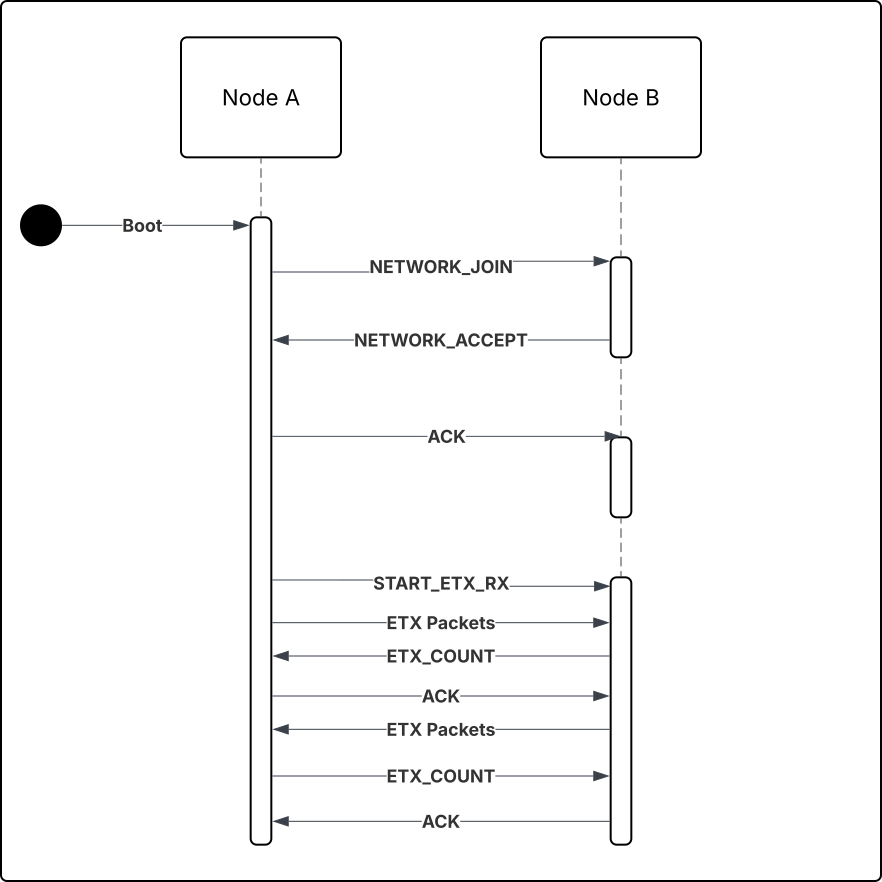

A network join command, `ControlParameter.NETWORK_JOIN`, is broadcasted to neighbouring nodes, containing a network identifier.

If the network ID is valid, the receiving node places the joining node into a pending authorization state, selects a random wait time, then sends `NETWORK_ACCEPT` and awaits acknowledgement.

If successful, the joining node is moved from pending to registered state, allowing full feature communication.

After successfully joining a network, the node enters benchmarking mode and attempts to benchmark all neighbouring registered nodes through ETX. Once completed, the node transitions to operating mode, where it listens continuously until transmission is due.

---

## Peer Tracking and Sequence Handling

The `PeerTable` class is responsible for keeping a record of all peers and providing methods to handle message sequences.

A `Peer` object is created when adding a new peer. It contains:

- `ReceiveState`
- `TransmitState`
- ETX score
- RSSI average
- ETX packet reception count

The transmit state stores separate sequence numbers for data packets and control packets. This is intentional. There is an emphasis in the implemented protocol to recover missed data packets, not control packets.

Losing control packets is expected and does not affect the functionality of a node in the same way. Data packets, depending on the application, are essential and cannot be lost.

### Sequence wrap-around

The identifier is 8-bit, so the sequence number wraps from 255 back to 0.

The reason only up to half of the maximum sequence is considered is to handle sequence wrap-around. If the expected sequence is 10, but received 200 instead, a modulo delta would indicate packet 200 is 190 steps ahead. Without the half-window rule, this could incorrectly trigger a huge NACK request from 11 up to 199.

By considering only up to half of the maximum sequence number, packet 200 in that scenario is treated as stale or duplicate instead.

---

## NACK Recovery

A Negative Acknowledgement packet, or NACK, is used to indicate missed packets. Unlike traditional ACK methods, where each message is acknowledged, NACK is only used to indicate missed messages.

Control packets rely on ACK because they are necessary to ensure the correct function is applied before proceeding. Data packets do not need to be acknowledged instantly, and retransmitting data packets is expensive.

A NACK is only transmitted when the receiving node gets an unexpected packet. This means whatever obstruction caused the previous data packet to fail may have cleared, and data transmission can reoccur now. This is more efficient and practical than acknowledging every data message.

The prototype includes:

- Missing packet ID computation
- NACK transmission
- NACK ACK response
- Recovery state object
- Retransmission state object
- Out-of-order retransmission mode

At the moment, RTS does not implement persistence storage integration. For prototype purposes, missed packets are generated. Packets missed twice are currently dropped. This area needs further improvement in future versions.

---

## ETX and RSSI Link Benchmarking

ETX benchmarking occurs during the startup cycle after joining a network, or when a new node joins and instructs active nodes to initiate ETX benchmarking.

ETX benchmarking requires one side to transmit a burst of packets while the other side anticipates it. The roles switch, and ETX is performed again in reverse. Results are then exchanged.

Expected Transmission Count, or ETX, is a metric which indicates the reliability of a link. It uses bursts of small packets transmitted in a short window of time.

During ETX benchmarking, the receiving node is also able to access the RSSI of each successfully received packet and calculate the average. RSSI, radio signal strength indicator, measured in dBm, indicates the strength of a radio signal.

---

## Routing and Path Planning

The Base Station has an essential function in RTS: routing decisions. It is expected to utilize dynamic metrics such as ETX, RSSI, and SNR to compute the most reliable and efficient route.

### Network graph

RTS is able to hold information regarding nodes and their connections. It supports a dynamically growing graph, which allows it to work with any network size, with no prerequisite to define the number of nodes.

A connection matrix stores information regarding each node, their edges, and each edge score.

### Dijkstra and backup paths

Dijkstra's algorithm has been implemented to calculate the cheapest route possible to the Base Station. Given the context of costs, the most reliable path is computed.

However, a single reliable path alone is prone to disruption in real-life scenarios. Backup parents are also computed by the Base Station. After the initial path computation, for each node, the connection between it and its parent is removed, Dijkstra is rerun, the backup parent is extracted, and the original connection matrix is restored.

### Routing table

<p align="center">
  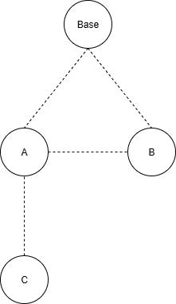
</p>

The `RoutingTable` class holds:

- Parent node ID
- Backup parent node ID
- Children dictionary

The children dictionary keys are destinations, while the values are the child node IDs.

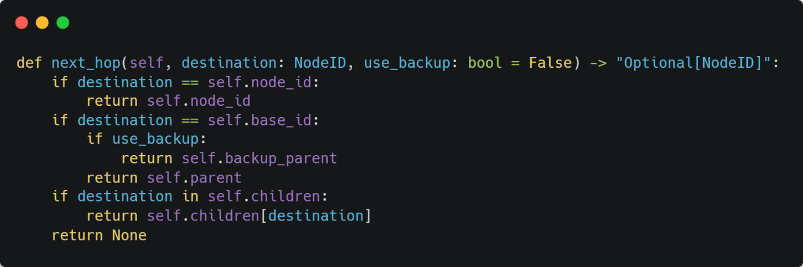

If the destination is the node's own ID, the message is saved. If the packet is meant to be forwarded upstream to the Base Station, the parent node ID is returned, or backup parent if the initial transmission failed. If the packet is meant to be forwarded downstream, the child ID is retrieved from the children dictionary.

### Routing distributor

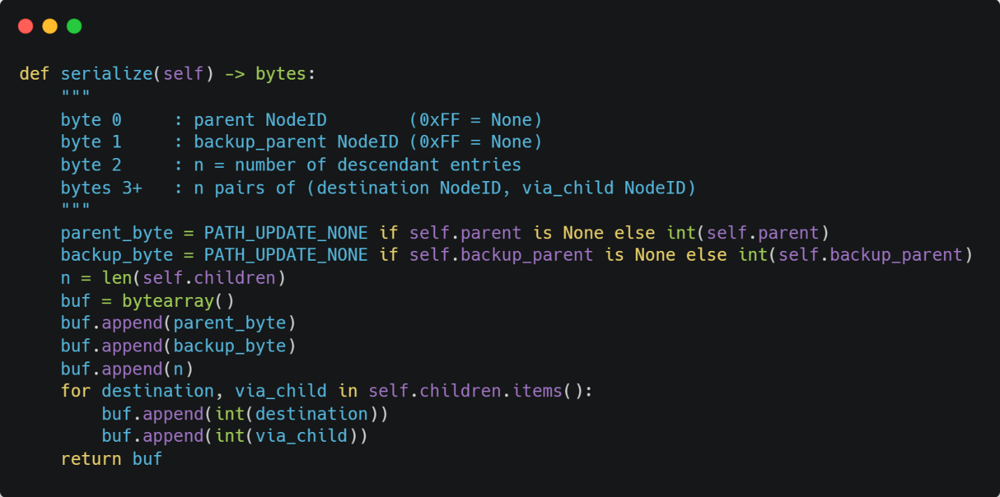

Proper routing distribution is critical to the intended mesh feature. Routing tables must be distributed in a breadth-first style, as nodes without a routing table will not collect, transmit, or forward data.

The current prototype uses hardcoded ETX graph data for routing computation. Dynamic ETX acquisition and forwarding of link quality to the Base Station is future work.

---

## Maintainability and Refactoring

RTS derives much of its strength from its architectural design, where modularity, minimal coupling, and high cohesion are priorities.

### Mixin-based structure

A mixin is a class which defines a set of functionality and related properties without requiring other classes to inherit from it directly. These properties are meant to be mixed with other classes. Mixins are not standalone classes and cannot function solely by themselves.

RTS uses mixins for the superclass `Node`, where all related functionalities from the mixins are combined.

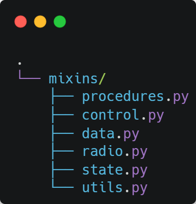

Current mixins include:

- `ProceduresMixin`: network operations such as joining, accepting, and ETX benchmarking.
- `ControlMixin`: control traffic, ACK/NACK handling, control receive and retry logic.
- `DataMixin`: data reception, transmission, frequency switching, recovery, and retransmission.
- `EtxMixin`: underlying ETX transmit and receive functionality.
- `RadioMixin`: Adafruit RFM9x interaction, channel acquisition, packet time calculation, and duty-cycle tracking.
- `UtilsMixin`: common utilities such as peer activity logging and raw packet decoding.

### Repository architecture

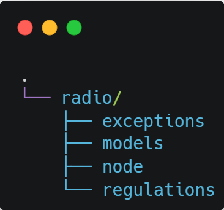

The RTS radio component has four main directories:

- `exceptions`
- `models`
- `node`
- `regulations`

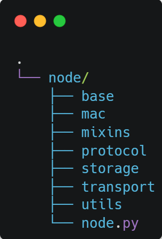

The `node` directory contains the main functional layers:

- `base`: Base Station features such as graph handling, routing table computation, and BFS routing distribution.
- `mac`: packet airtime, band airtime, band/channel selection, duty-cycle tracking, and backoff logic.
- `mixins`: separated node behaviours.
- `protocol`: parameters, validators, ETX, and RSSI calculations.
- `storage`: persistence manager interface.
- `transport`: peer and peer table logic.
- `utils`: common utilities.

### Type annotations

Type annotations are an essential part of the codebase. They increase code readability, decrease type-related bugs, and enhance maintainability. Therefore, RTS operates with MyPy under strict mode where possible.

CircuitPython does not support all standard Python features used on desktop Python. This meant running local code tests was rarely an option, while also reshaping parts of the architecture, such as emulating enum-style classes and dataclass-style structures.

---

## Testing and Evaluation

### Test 1 - Startup, Routing, and Transmission

Purpose:

- Verify network join
- Verify ETX benchmarking
- Verify routing table computation
- Verify routing table distribution
- Verify downstream data forwarding
- Verify upstream data forwarding

Setup:

- Base Station - Node ID: 0
- Node A - Node ID: 1
- Node B - Node ID: 2
- All nodes indoor and close range
- Ideal radio environment
- Hardcoded ETX graph metrics: Base - A - B
- Routing table computed dynamically
- Serial logs recorded
- Radio signals monitored with an RTL-SDR via CubicSDR

### Procedure and expected results

The procedure involved powering on the Base Station, waiting for startup to complete, then powering on Node A, followed by Node B.

Node A was required to perform a 3-way handshake to join the network with the Base Station, registering the Base Station as a peer. This was followed by ETX benchmarking.

Node B was required to perform a 3-way handshake to join the network with Node A and the Base Station, irrespective of order, registering both as peers. Following it, ETX benchmarking was expected with each node.

Once Node B registered, but before it completed startup, the Base Station was expected to start a 60 second timer before routing tables were distributed. Node A's routing table was expected to be distributed first, then Node B's routing table through Node A.

Node A was expected to transmit directly to the Base Station. Node B was expected to transmit to the Base Station via Node A, with Node A forwarding the data packet.

### Serial log results

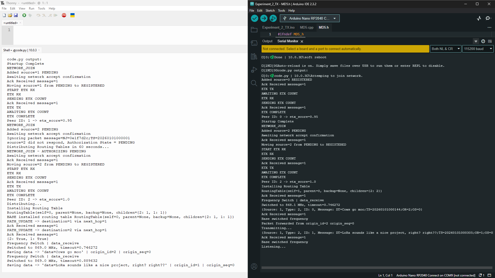

Observed during Node A startup:

1. Base Station completed startup successfully.
2. Node A attempted to join the network.
3. Base Station moved Node A into pending authorization state.
4. Node A registered Base Station.
5. Node A acknowledged, and Base Station moved Node A into registered authorization state.
6. Node A started ETX in transmission mode, Base Station in reception mode.
7. ETX score was 0.95 on both sides.

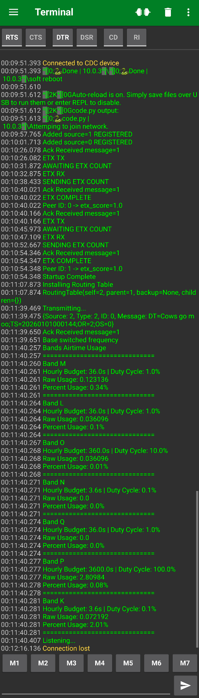

Observed during Node B startup:

1. Node B attempted to join the network.
2. Node A moved Node B into pending authorization state.
3. Node B registered Node A.
4. Node A moved Node B into registered authorization state.
5. Base Station moved Node B into pending authorization state.
6. Node B registered Base Station.
7. Node B's acknowledgement initially failed to be received by Base Station.
8. Base Station received another network join request and accepted it.
9. Base Station started the routing table distribution timer.
10. Node B started ETX in transmission mode for both Node A and Base Station.
11. Base Station and Node A link with Node B scored 1.0.
12. Node B's startup completed.

### Routing distribution and data forwarding

The Base Station computed the routing table and started distribution. The Base Station installed its own routing table, sent a path update to Node A, then sent Node B's routing table through Node A. Node A validated and acknowledged the Base Station, then forwarded the routing table downstream to Node B.

After routing installation, Node B transmitted first, followed by Node A.

Node B transmitted a `FREQUENCY_SWITCH` command, Node A acknowledged, Node B transmitted the data packet, and Node A forwarded the data packet to Base Station. Base Station outputted the data packet with origin ID 2, Node B.

Node A then transmitted directly to the Base Station. Base Station outputted the data packet with origin ID 1, Node A.

### Conclusion

Overall, the test results matched what was expected and confirmed that core RTS features are operational and work as intended.

Additionally, the recovery process was observed after Node B failed to acknowledge the Base Station's network accept request. Node B continued broadcasting network join requests, while the Base Station reattempted network accept requests and moved Node B to registered authorization state after receiving the acknowledgement packet.

### CubicSDR observations

The graphs below are read from bottom to top. Bottom is older and top is newer.

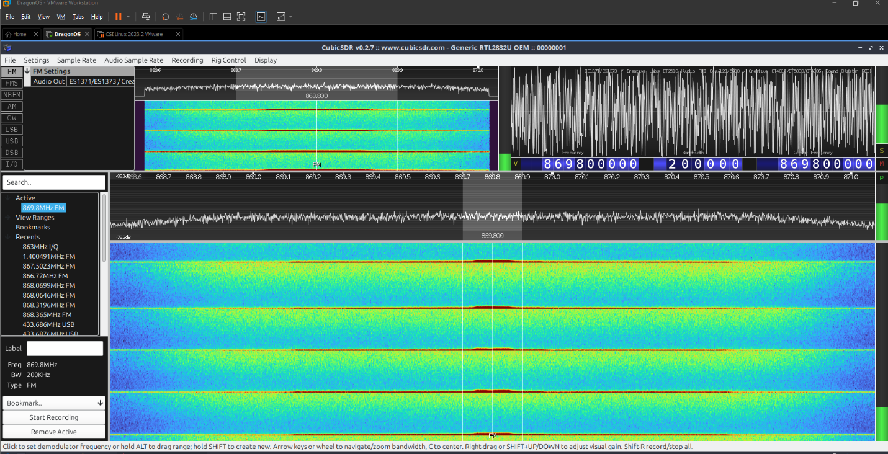

When a node attempts to join a network, it broadcasts network join requests, which are shown visually above.

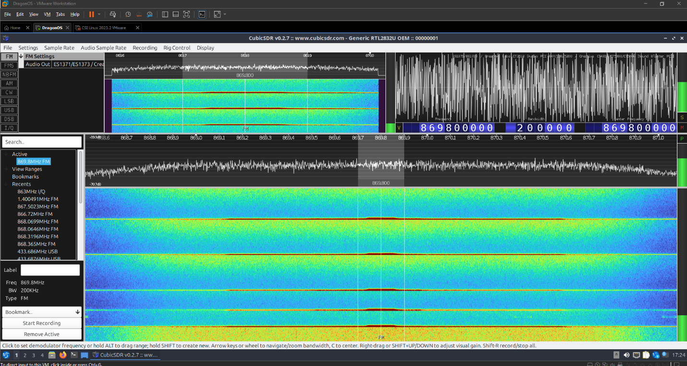

The initial red line at the bottom is a network join request, followed by a network accept, then an ACK sent back. The two lines at the top are repeated network join requests. Once a node registers a peer, it still continues to broadcast network join requests in an attempt to allow other nodes to register it in case of radio failure.

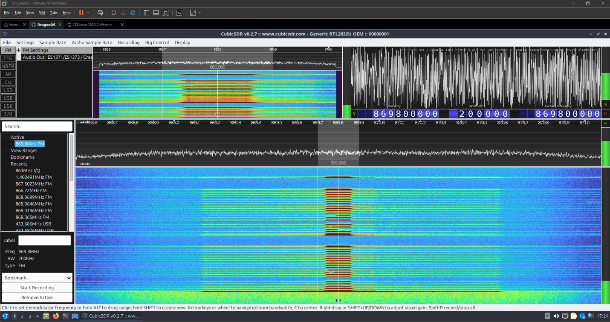

The first line with a tall peak is a start ETX request and acknowledgement. This is followed by a continuous burst of small packets. Afterwards, ETX count is sent, roles are switched, and the ETX burst pattern repeats.

### Outdoor testing

Outdoor testing was performed multiple times, but due to non-ideal setup, hardware limitations, and numerous uncontrolled variables, the results were inconclusive and details have been omitted.

What can be concluded is that in urban areas a signal can be established beyond 1.06 km. Testing further than that was not performed, but the signal quality observed was sufficient for extended range.

Close range testing revealed that certain buildings, primarily built with cement or metallic cladding, are able to totally absorb or reflect the signal respectively. This made testing in close proximity difficult and produced inconsistent results.


---

## Current Limitations

The current prototype is functional, but incomplete. The main limitations are:

- Webserver integration is not complete.
- ETX scores are shared peer-to-peer but are not yet dynamically transmitted to the Base Station for routing decisions.
- RSSI average is stored locally but not transmitted to the Base Station.
- SNR is not tracked.
- Persistence storage integration is not complete.
- NACK recovery currently generates missed packets for prototype purposes.
- Packets missed twice are dropped.
- Secure transmission is not implemented due to current hardware limitations.
- Full large-scale outdoor testing has not been performed.
- Routing table distribution failures for deeper nodes are not fully observable by the Base Station.

---

## Future Work

RTS currently has a working prototype of an embedded radio stack, which is a serious foundation, but not the final artifact for commercial use.

The most successful parts of the project are its architecture, duty-cycle aware communication, and protocol logic.

The following are goals to be met in order to seriously compete with LoRaWAN and distinguish RTS from other LoRa MAC layer protocols:

- Full multi-hop runtime forwarding
- Dynamic ETX routing updates
- SD card persistence
- Secure transmission
- Webserver integration
- Clock synchronization
- Sensor template integration
- Compatibility with LoRaWAN
- Support for additional protocols beyond LoRa

The last two features are there for a practical reason. Replacing LoRaWAN completely is not realistic, as it already exists and migrating systems is difficult and costly. Supporting LoRaWAN would allow RTS to extend current systems to larger areas, increasing the likelihood of adoption.

Support for additional protocols beyond LoRa, such as satellite connectivity, may also make RTS more useful in remote deployments.

---

## Version Summary

Current prototype version:

```text
v0.0.23-proto
```

Main development milestones:

| Version | Main Contribution |
|---|---|
| v0.0.1-proto | Initial Prototype Skeleton |
| v0.0.2-proto | Add ETX, Duty Cycle, and RSSI Core Functionality |
| v0.0.3-proto | Implement ETX and Correct RSSI Validation Logic |
| v0.0.4-proto | Add Regulation Errors, Band Utilities, and Startup Behaviour |
| v0.0.5-proto | Add Packet Infrastructure, Backoff Logic, and Startup Broadcast Skeleton |
| v0.0.6-proto | Reorganize Models, Add Exceptions Framework, and Extend Node Radio Setup |
| v0.0.7-proto | Split Webserver into Separate Repository and Promote Radio as Top-Level Module |
| v0.0.8-proto | Refactor MAC Utilities and Introduce Regulation Registry |
| v0.0.9-proto | Introduce Duty Cycle Tracking and Airtime Calculations |
| v0.0.10-proto | Add Band Selection Scheduler and Integrate Duty Cycle Enforcement |
| v0.0.11-proto | Adapt Codebase for Challenger RP2040 Environment and Patch RFM9x Module |
| v0.0.12-proto | Introduce NACK-Based Recovery Flow and Peer Sequence Tracking |
| v0.0.13-proto | Add ETX Control Flow and Standardize Packet Type Hints |
| v0.0.14-proto | Split Node into Mixins and Add Runtime Type Fallbacks |
| v0.0.15-proto | Add Protocol Parameters Layer and Legal Channel Acquisition Flow |
| v0.0.16-proto | Complete Network Join/Accept Flow and Add Peer Authorization State |
| v0.0.17-proto | Authorization Completion, Rejoin Flow, and Pending State Handling |
| v0.0.18-proto | Fix Network Join Reception Window and Channel Acquisition Order |
| v0.0.19-proto | Refactor Main Receive Flow and Expand ETX Startup Workflow |
| v0.0.20-proto | Add Node Runtime Loop and Unify Packet Transmission Paths |
| v0.0.21-proto | Add Routing Table Support and Upstream Transmission Flow |
| v0.0.22-proto | Add Routing Distribution and Forwardable Path Update Commands |
| v0.0.23-proto | Adjust Three-Node Routing Test Setup and Rename Control Routing Terms |

---

## References

The following references are kept here for attribution and technical context.

[1] The Things Network, "Frequency Plans by Country." https://www.thethingsnetwork.org/docs/lorawan/frequencies-by-country/

[2] The Things Network, "What are LoRa and LoRaWAN?" https://www.thethingsnetwork.org/docs/lorawan/what-is-lorawan/

[3] D. S. J. De Couto, "High-Throughput Routing for Multi-Hop Wireless Networks," PhD dissertation, MIT. https://pdos.lcs.mit.edu/papers/grid:decouto-phd/thesis.pdf

[4] iLab Electronics, "Challenger RP2040 LoRa (868MHz)." https://ilabs.se/product/challenger-rp2040-lora/

[5] DreamLNK, "RFM95 868/915Mhz SX1276 Wireless Transceiver Modules." https://www.iot-rf.com/868-915MHz-wireless-transceive-module-RFM95.html

[6] S. Ghoslya, "All About LoRa and LoRaWAN: LoRa: Orthogonality." https://www.sghoslya.com/p/lora_6.html

[7] Semtech Corporation, "SX1276/77/78/79 - 137 MHz to 1020 MHz Low Power Long Range Transceiver," datasheet. https://semtech.my.salesforce.com/

[8] MyPy documentation. https://mypy.readthedocs.io/en/stable/

[9] Dryad Networks, "Silvanet Mesh Gateway." https://www.dryad.net/meshgateway

[10] W3Schools, "DSA Dijkstra's Algorithm." https://www.w3schools.com/dsa/dsa_algo_graphs_dijkstra.php

[11] The Things Network, "dB, dBm, dBi and dBd." https://www.thethingsnetwork.org/docs/lorawan/db-dbm-dbi-dbd/

[12] HopeRF, "RFM95W/96W/98W," datasheet. https://cdn.sparkfun.com/assets/a/9/6/1/0/RFM95W-V2.0.pdf

[13] ETSI, "ETSI EN 300 220-2 V3.3.1 (2025-03)." https://www.etsi.org/deliver/etsi_en/300200_300299/30022002/03.03.01_60/en_30022002v030301p.pdf

[14] Semtech Corporation, "FAQ." https://www.semtech.com/design-support/faq
